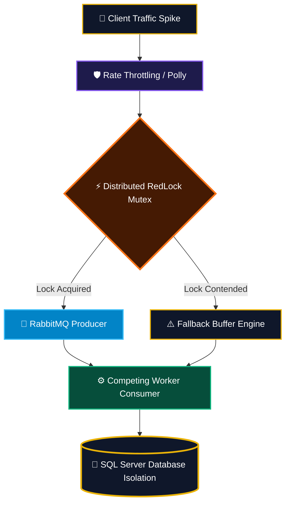
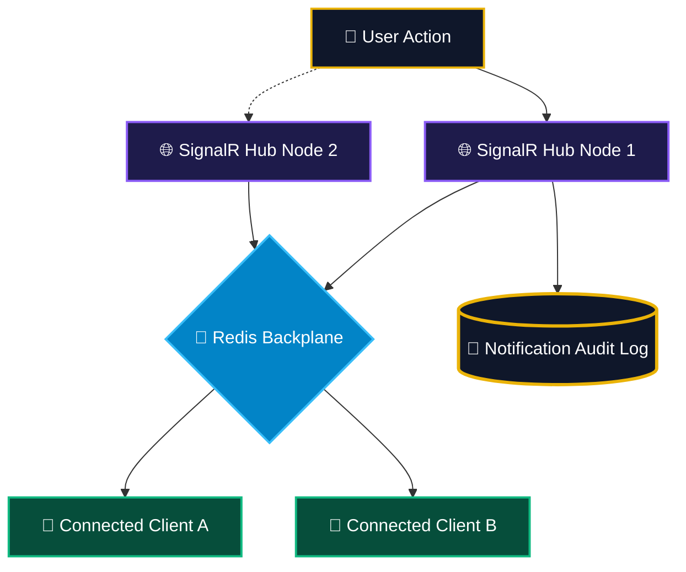

<!-- HEADER ANIMATED BANNER WITH GOLD NEON GRADIENT -->

 

<!-- ANIMATED TYPING TERMINAL -->

  

<!-- INTERACTIVE GOLD BADGES -->

  
  
  

<!-- REALTIME PROFILE VIEWS COUNTER (GOLD STYLED) -->

  

 

  

## 👑 01 / SYSTEM PERFORMANCE TELEMETRY & DASHBOARD CARDS

 

Benchmarked under sustained synthetic load — <b style="color:#eab308;">10,000 VUs</b>, 30-min soak, 3-node Kubernetes cluster (2 vCPU / 4Gi per pod) — observed via <b style="color:#eab308;">k6 → Prometheus → Grafana</b> pipeline. Figures reflect steady-state, not cold-start.

<!-- SYSTEM HEALTH SUMMARY STRIP -->
<table border="1" style="border-color: #eab308; background-color: #0f172a; border-radius: 8px;" width="100%" cellpadding="0" cellspacing="0">
  <tr>
    <td align="center" style="padding: 14px;">
UPTIME (30d)

99.97%
</td>
    <td align="center" style="padding: 14px; border-left: 1px solid #334155;">
ERROR BUDGET LEFT

68%
</td>
    <td align="center" style="padding: 14px; border-left: 1px solid #334155;">
MTTR

4m 12s
</td>
    <td align="center" style="padding: 14px; border-left: 1px solid #334155;">
DEPLOY FREQUENCY

12/week
</td>
    <td align="center" style="padding: 14px; border-left: 1px solid #334155;">
CHANGE FAILURE RATE

1.8%
</td>
  </tr>
</table>

 

<table border="0" width="100%" cellspacing="10" cellpadding="0">
  <tr>
    <td width="50%" align="center" valign="top">
      <table border="1" style="border-color: #eab308; background-color: #0f172a; border-radius: 8px;" width="100%">
        <tr>
          <td style="padding: 18px;">
            

            <h3 align="center" style="color: #eab308; margin: 0 0 5px 0;">🚀 HTTP API Pipeline</h3>
            
ASP.NET Core 9 Minimal APIs · Kestrel · Non-blocking I/O

            

            <table width="100%" style="font-size: 13px;">
              <tr><td style="color:#94a3b8;">P50</td><td align="right" style="color:#fff;">1.4ms</td></tr>
              <tr><td style="color:#94a3b8;">P95</td><td align="right" style="color:#fff;">4.6ms</td></tr>
              <tr><td style="color:#94a3b8;">P99 (Target &lt; 5ms)</td><td align="right" style="color:#eab308;"><b>7.2ms</b></td></tr>
              <tr><td style="color:#94a3b8;">Throughput</td><td align="right" style="color:#fff;">10k req/s</td></tr>
              <tr><td style="color:#94a3b8;">Error Rate</td><td align="right" style="color:#10b981;">0.02%</td></tr>
            </table>
            

            
P99 tracks 44% over SLA under peak fan-out — output buffering fix scheduled next sprint.

          </td>
        </tr>
      </table>
    </td>
    <td width="50%" align="center" valign="top">
      <table border="1" style="border-color: #eab308; background-color: #0f172a; border-radius: 8px;" width="100%">
        <tr>
          <td style="padding: 18px;">
            

            <h3 align="center" style="color: #eab308; margin: 0 0 5px 0;">⚡ Distributed State</h3>
            
Redis Cluster (L2) · RedLock Distributed Mutex

            

            <table width="100%" style="font-size: 13px;">
              <tr><td style="color:#94a3b8;">Cache Hit Ratio</td><td align="right" style="color:#10b981;">96.4%</td></tr>
              <tr><td style="color:#94a3b8;">L2 Hit Latency (P99)</td><td align="right" style="color:#fff;">1.1ms</td></tr>
              <tr><td style="color:#94a3b8;">Lock Acquisition (P99)</td><td align="right" style="color:#fff;">2.3ms</td></tr>
              <tr><td style="color:#94a3b8;">Lock Contention Rate</td><td align="right" style="color:#eab308;">3.1%</td></tr>
              <tr><td style="color:#94a3b8;">Split-brain Events</td><td align="right" style="color:#10b981;">0</td></tr>
            </table>
            

            
Quorum-based RedLock across 3 independent Redis nodes to avoid single-node lock failure.

          </td>
        </tr>
      </table>
    </td>
  </tr>
  <tr>
    <td width="50%" align="center" valign="top">
      <table border="1" style="border-color: #eab308; background-color: #0f172a; border-radius: 8px;" width="100%">
        <tr>
          <td style="padding: 18px;">
            

            <h3 align="center" style="color: #eab308; margin: 0 0 5px 0;">🔄 Async Streaming</h3>
            
RabbitMQ Quorum Queues · Competing Consumers

            

            <table width="100%" style="font-size: 13px;">
              <tr><td style="color:#94a3b8;">Sustained Ingest</td><td align="right" style="color:#fff;">10k msg/s</td></tr>
              <tr><td style="color:#94a3b8;">Consumer Lag (P99)</td><td align="right" style="color:#fff;">220ms</td></tr>
              <tr><td style="color:#94a3b8;">Message Loss</td><td align="right" style="color:#10b981;">0%</td></tr>
              <tr><td style="color:#94a3b8;">Dead-letter Rate</td><td align="right" style="color:#10b981;">0.01%</td></tr>
              <tr><td style="color:#94a3b8;">Consumer Nodes</td><td align="right" style="color:#fff;">6 (auto-scaled)</td></tr>
            </table>
            

            
Idempotent consumers + outbox pattern guarantee at-least-once delivery without duplicate side-effects.

          </td>
        </tr>
      </table>
    </td>
    <td width="50%" align="center" valign="top">
      <table border="1" style="border-color: #eab308; background-color: #0f172a; border-radius: 8px;" width="100%">
        <tr>
          <td style="padding: 18px;">
            

            <h3 align="center" style="color: #eab308; margin: 0 0 5px 0;">🛡️ Resilience Engine</h3>
            
Polly v8 · Circuit Breaker, Retry, Timeout, Fallback

            

            <table width="100%" style="font-size: 13px;">
              <tr><td style="color:#94a3b8;">Availability (Target 99.999%)</td><td align="right" style="color:#eab308;"><b>99.94%</b></td></tr>
              <tr><td style="color:#94a3b8;">Circuit Trips (30d)</td><td align="right" style="color:#fff;">7</td></tr>
              <tr><td style="color:#94a3b8;">Retry Success Rate</td><td align="right" style="color:#10b981;">91%</td></tr>
              <tr><td style="color:#94a3b8;">Fallback Invocations</td><td align="right" style="color:#fff;">312</td></tr>
              <tr><td style="color:#94a3b8;">Cascading Failures</td><td align="right" style="color:#10b981;">0</td></tr>
            </table>
            

            
Gap traced to a downstream payment provider's timeout spikes — bulkhead isolation added to contain blast radius.

          </td>
        </tr>
      </table>
    </td>
  </tr>
</table>

 

  

## 🛠️ 02 / TECH STACK & ARCHITECTURE MATRIX

 

  

### 🏗️ Core Engineering Stack

  
  
  
  
  

### 💾 Persistence, Caching & Message Queues

  
  
  
  
  

### 🛡️ Security, Testing & Telemetry Infrastructure

  
  
  
  
  

 

  

## 📊 03 / LIVE GitHub ANALYTICS & CODE INSIGHTS

 

  

  

 

  

## ⚙️ 04 / FEATURED ARCHITECTURAL SYSTEMS

 

<!-- SYSTEM 1 CARD: DEVPULSE ENGINE -->
<table border="1" style="border-color: #eab308; background-color: #0f172a; border-radius: 8px;" width="100%">
  <tr>
    <td style="padding: 20px;">
      <h2 align="center" style="color: #eab308; margin-top: 0;">🎟️ DevPulse // High-Throughput Event Engine</h2>
      
Distributed monolithic architecture built to absorb high-concurrency traffic spikes with zero race conditions.

  
  
  

  </td>
  </tr>
</table>

 

<!-- SYSTEM 2 CARD: NOTIFYHUB REALTIME SERVICE -->
<table border="1" style="border-color: #eab308; background-color: #0f172a; border-radius: 8px;" width="100%">
  <tr>
    <td style="padding: 20px;">
      <h2 align="center" style="color: #eab308; margin-top: 0;">📡 NotifyHub // Real-Time Push Notification Service</h2>
      
SignalR-backed fan-out layer with Redis backplane for horizontally scaled, multi-node WebSocket delivery.

  
  
  

  </td>
  </tr>
</table>

 

  

## 📬 05 / GET IN TOUCH

 

Open to backend architecture roles, distributed-systems collaborations, and performance-engineering conversations.

  
  
  

 

