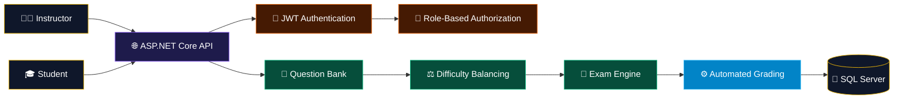
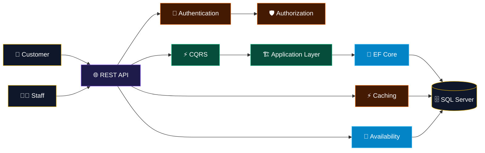
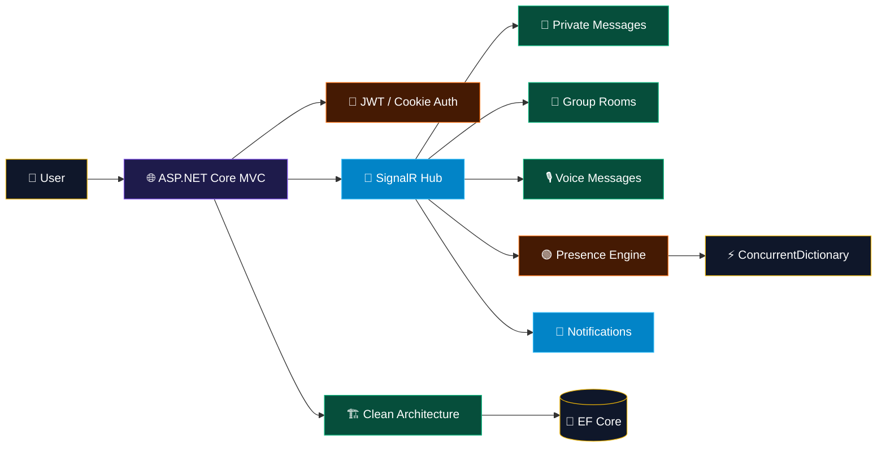

<!-- ═══════════════════════════════════════════════════════════════ -->

<!--                    FUTURISTIC HEADER                            -->

<!-- ═══════════════════════════════════════════════════════════════ -->

 

<!-- FUTURISTIC TYPING TERMINAL -->

  

<!-- CONTACT MATRIX -->

<!-- PROFILE TELEMETRY -->

 

  

<!-- ═══════════════════════════════════════════════════════════════ -->

<!--                    01 / PROFILE CORE                           -->

<!-- ═══════════════════════════════════════════════════════════════ -->

## 👑 01 / BACKEND ENGINEERING CORE

 

<table border="1" style="border-color:#eab308;background-color:#0f172a;border-radius:10px;" width="100%" cellpadding="0" cellspacing="0">

<tr>

<td align="center" width="25%" style="padding:20px;">

⚙️

<h3 style="color:#eab308;">API ENGINEERING</h3>

ASP.NET Core 
RESTful APIs 
MVC 
EF Core

</td>

<td align="center" width="25%" style="padding:20px;">

🏗️

<h3 style="color:#eab308;">ARCHITECTURE</h3>

Clean Architecture 
CQRS 
MediatR 
SOLID

</td>

<td align="center" width="25%" style="padding:20px;">

🛡️

<h3 style="color:#eab308;">SECURITY</h3>

JWT 
Identity 
2FA / OTP 
OAuth 2.0

</td>

<td align="center" width="25%" style="padding:20px;">

🧪

<h3 style="color:#eab308;">TESTING</h3>

Unit Testing 
Integration Testing 
API Testing 
Performance Testing

</td>

</tr>

</table>

 

<table border="1" style="border-color:#334155;background-color:#0f172a;border-radius:10px;" width="100%">

<tr>

<td align="center" style="padding:18px;">

ENGINEERING PHILOSOPHY

<h2 style="color:#eab308;">DRY · KISS · YAGNI · SOLID</h2>

Build what is needed. Keep it simple. Avoid duplication.
Design for maintainability, correctness, and clear business logic.

</td>

</tr>

</table>

 

  

<!-- ═══════════════════════════════════════════════════════════════ -->

<!--                    02 / TECH STACK                             -->

<!-- ═══════════════════════════════════════════════════════════════ -->

## 🛠️ 02 / TECH STACK MATRIX

 

  

### ⚡ BACKEND CORE

### 🏗️ ARCHITECTURE & DESIGN

### 💾 DATA & PERSISTENCE

### 🔐 SECURITY & IDENTITY

### 📡 REAL-TIME & BACKGROUND

### 🧪 TESTING & QUALITY

### 🔧 DEVELOPMENT TOOLS

 

  

<!-- ═══════════════════════════════════════════════════════════════ -->

<!--                    03 / PROJECT SYSTEMS                        -->

<!-- ═══════════════════════════════════════════════════════════════ -->

## ⚙️ 03 / FEATURED BACKEND SYSTEMS

 

<!-- EXAMINATION SYSTEM -->

<table border="1" style="border-color:#eab308;background-color:#0f172a;border-radius:10px;" width="100%">

<tr>

<td style="padding:25px;">

<h2 align="center" style="color:#eab308;">
🎓 Examination System
</h2>

Multi-role examination platform designed around secure APIs,
automated grading, and reusable question management.

 

 

</td>

</tr>

</table>

 

<!-- HOTEL -->

<table border="1" style="border-color:#eab308;background-color:#0f172a;border-radius:10px;" width="100%">

<tr>

<td style="padding:25px;">

<h2 align="center" style="color:#eab308;">
🏨 Hotel Reservation System
</h2>

Clean Architecture + CQRS reservation platform focused on
transactional booking, availability consistency, authorization, and API performance.

 

 

</td>

</tr>

</table>

 

<!-- CHAT -->

<table border="1" style="border-color:#eab308;background-color:#0f172a;border-radius:10px;" width="100%">

<tr>

<td style="padding:25px;">

<h2 align="center" style="color:#eab308;">
📡 Real-Time Chat System
</h2>

Real-time communication platform powered by SignalR,
Clean Architecture, JWT authentication, and connection-aware presence tracking.

 

 

</td>

</tr>

</table>

 

  

<!-- ═══════════════════════════════════════════════════════════════ -->

<!--                    04 / TESTING                                -->

<!-- ═══════════════════════════════════════════════════════════════ -->

## 🧪 04 / QUALITY & TESTING ENGINE

 

<table border="1" style="border-color:#eab308;background-color:#0f172a;border-radius:10px;" width="100%">

<tr>

<td align="center" width="25%" style="padding:20px;">

<h3 style="color:#eab308;">UNIT</h3>

NUnit 
Moq 
AAA Pattern 
Assertions

</td>

<td align="center" width="25%" style="padding:20px;">

<h3 style="color:#eab308;">INTEGRATION</h3>

WebApplicationFactory 
EF Core In-Memory 
DI Testing 
API Pipeline

</td>

<td align="center" width="25%" style="padding:20px;">

<h3 style="color:#eab308;">API</h3>

HTTP Testing 
HttpClient 
Swagger 
Postman

</td>

<td align="center" width="25%" style="padding:20px;">

<h3 style="color:#eab308;">PERFORMANCE</h3>

Load Testing 
Stress Testing 
Latency 
Throughput

</td>

</tr>

</table>

 

 

  

<!-- ═══════════════════════════════════════════════════════════════ -->

<!--                    05 / GITHUB ANALYTICS                       -->

<!-- ═══════════════════════════════════════════════════════════════ -->

## 📊 05 / GITHUB TELEMETRY

 

  

  

 

  

<!-- ═══════════════════════════════════════════════════════════════ -->

<!--                    06 / ENGINEERING IDENTITY                   -->

<!-- ═══════════════════════════════════════════════════════════════ -->

## 🧠 06 / ENGINEERING MINDSET

 

<table border="1" style="border-color:#eab308;background-color:#0f172a;border-radius:10px;" width="100%">

<tr>

<td align="center" style="padding:25px;">

<h2 style="color:#eab308;">
BUILD → TEST → MEASURE → IMPROVE
</h2>

Backend engineering focused on clean architecture,
secure APIs, reliable business logic, real-time communication,
automated testing, and continuous performance improvement.

 

</td>

</tr>

</table>

 

  

<!-- ═══════════════════════════════════════════════════════════════ -->

<!--                    07 / CONTACT                                -->

<!-- ═══════════════════════════════════════════════════════════════ -->

## 📬 07 / CONNECT WITH NOUR

 

Backend .NET Developer focused on building secure,
maintainable, testable, and scalable backend systems.

 

  

 

<!-- ═══════════════════════════════════════════════════════════════ -->

<!--                         FOOTER                                  -->

<!-- ═══════════════════════════════════════════════════════════════ -->

