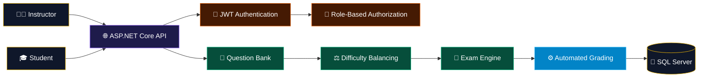
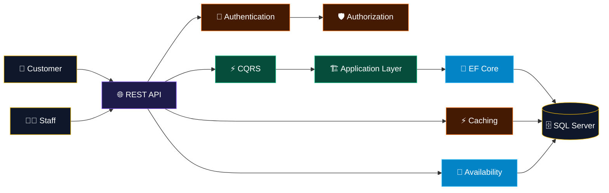
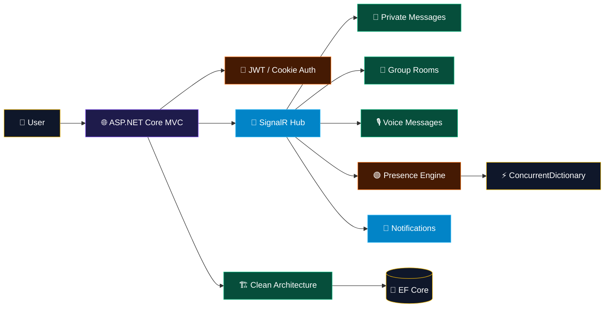

<!-- ═══════════════════════════════════════════════════════════════ -->
<!--                    HEADER                                       -->
<!-- ═══════════════════════════════════════════════════════════════ -->

 

  

 

  

<!-- ═══════════════════════════════════════════════════════════════ -->
<!--                    01 / PROFILE CORE                            -->
<!-- ═══════════════════════════════════════════════════════════════ -->

## 👑 01 / BACKEND ENGINEERING CORE

<table width="100%">
<tr>

<td align="center" width="25%">
<h3>⚙️ API ENGINEERING</h3>
ASP.NET Core RESTful APIs MVC EF Core
</td>

<td align="center" width="25%">
<h3>🏗️ ARCHITECTURE</h3>
Clean Architecture CQRS MediatR SOLID
</td>

<td align="center" width="25%">
<h3>🛡️ SECURITY</h3>
JWT Identity 2FA / OTP OAuth 2.0
</td>

<td align="center" width="25%">
<h3>🧪 TESTING</h3>
Unit Testing Integration Testing API Testing Performance Testing
</td>

</tr>
</table>

 

<table width="100%">
<tr>
<td align="center">

**ENGINEERING PHILOSOPHY**

### DRY · KISS · YAGNI · SOLID

Build what is needed. Keep it simple. Avoid duplication.
Design for maintainability, correctness, and clear business logic.

</td>
</tr>
</table>

 

  

<!-- ═══════════════════════════════════════════════════════════════ -->
<!--                    02 / TECH STACK                              -->
<!-- ═══════════════════════════════════════════════════════════════ -->

## 🛠️ 02 / TECH STACK MATRIX

  

### ⚡ Backend Core

  

### 🏗️ Architecture & Design Patterns

  

### 💾 Data & Persistence

  

### 🔐 Security & Identity

  

### 📡 Real-Time & Background Processing

  

### 🧪 Testing & Quality

  

### 🔧 Development Tools

 

  

<!-- ═══════════════════════════════════════════════════════════════ -->
<!--                    03 / PROJECT SYSTEMS                         -->
<!-- ═══════════════════════════════════════════════════════════════ -->

## ⚙️ 03 / FEATURED BACKEND SYSTEMS

<table width="100%">
<tr>
<td>

<h3 align="center">🎓 Examination System</h3>

Multi-role examination platform designed around secure APIs,
automated grading, and reusable question management.

</td>
</tr>
</table>

 

<table width="100%">
<tr>
<td>

<h3 align="center">🏨 Hotel Reservation System</h3>

Clean Architecture + CQRS reservation platform focused on
transactional booking, availability consistency, authorization, and API performance.

</td>
</tr>
</table>

 

<table width="100%">
<tr>
<td>

<h3 align="center">📡 Real-Time Chat System</h3>

Real-time communication platform powered by SignalR,
Clean Architecture, JWT authentication, and connection-aware presence tracking.

</td>
</tr>
</table>

 

  

<!-- ═══════════════════════════════════════════════════════════════ -->
<!--                    04 / TESTING                                 -->
<!-- ═══════════════════════════════════════════════════════════════ -->

## 🧪 04 / QUALITY & TESTING ENGINE

<table width="100%">
<tr>

<td align="center" width="25%">
<h3>UNIT</h3>
NUnit Moq AAA Pattern Assertions
</td>

<td align="center" width="25%">
<h3>INTEGRATION</h3>
WebApplicationFactory EF Core In-Memory DI Testing API Pipeline
</td>

<td align="center" width="25%">
<h3>API</h3>
HTTP Testing HttpClient Swagger Postman
</td>

<td align="center" width="25%">
<h3>PERFORMANCE</h3>
Load Testing Stress Testing Latency Throughput
</td>

</tr>
</table>

 

 

  

<!-- ═══════════════════════════════════════════════════════════════ -->
<!--                    05 / GITHUB ANALYTICS                        -->
<!-- ═══════════════════════════════════════════════════════════════ -->

## 📊 05 / GITHUB TELEMETRY

  

  

 

  

<!-- ═══════════════════════════════════════════════════════════════ -->
<!--                    06 / ENGINEERING IDENTITY                    -->
<!-- ═══════════════════════════════════════════════════════════════ -->

## 🧠 06 / ENGINEERING MINDSET

<table width="100%">
<tr>
<td align="center">

### BUILD → TEST → MEASURE → IMPROVE

Backend engineering focused on clean architecture,
secure APIs, reliable business logic, real-time communication,
automated testing, and continuous performance improvement.

 

</td>
</tr>
</table>

 

  

<!-- ═══════════════════════════════════════════════════════════════ -->
<!--                    07 / CONTACT                                 -->
<!-- ═══════════════════════════════════════════════════════════════ -->

## 📬 07 / CONNECT WITH NOUR

Backend .NET Developer focused on building secure,
maintainable, testable, and scalable backend systems.

  

  

 

<!-- ═══════════════════════════════════════════════════════════════ -->
<!--                         FOOTER                                   -->
<!-- ═══════════════════════════════════════════════════════════════ -->

