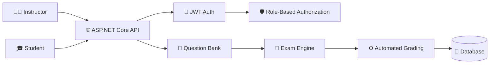
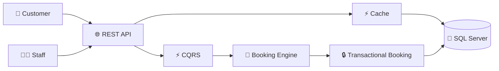
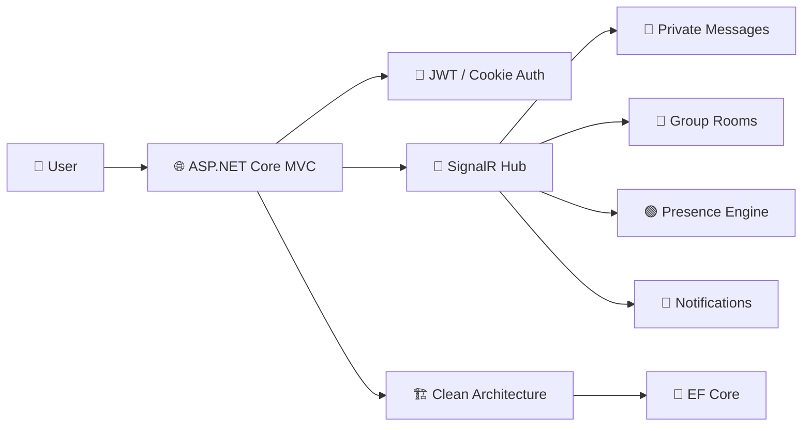

 

  

---

## 👑 BACKEND CORE

| API Engineering | Architecture | Security | Quality |
|:---:|:---:|:---:|:---:|
| ASP.NET Core • Web API • MVC • RESTful APIs | Clean Architecture • CQRS • MediatR • Repository Pattern • SOLID | ASP.NET Identity • JWT • 2FA • OTP • OAuth 2.0 | Unit • Integration • API • Performance Testing |

**Principles:** `DRY` `KISS` `YAGNI` `SOLID` — simple systems, clear business logic, built for maintainability.

---

## 🛠️ TECH STACK

| Category | Stack |
|---|---|
| **Language & Runtime** |   |
| **Backend** |    |
| **Architecture** |      |
| **Data Layer** |    |
| **Security** |      |
| **Real-Time & Jobs** |      |
| **Testing** |      |
| **Dev Tools** |     |

---

## 🚀 FEATURED SYSTEMS

### 🎓 Examination System — *Multi-Role Examination Platform*
Backend system built around instructors, students, automated grading, reusable question banks, and secure access control.

`AUTOMATED GRADING` `MULTI-ROLE` `JWT SECURITY`

### 🏨 Hotel Reservation System — *Clean Architecture + CQRS*
Reservation backend focused on transactional booking, room availability, authorization, caching, and optimized data access.

`CLEAN ARCHITECTURE` `CQRS` `TRANSACTIONAL BOOKING` `PERFORMANCE ~15%`

### 📡 Real-Time Chat System — *ASP.NET Core MVC + SignalR + Clean Architecture*
Real-time communication system supporting private messaging, group rooms, voice messages, notifications, and live user presence.

`SIGNALR REAL-TIME` `PRIVATE MESSAGING` `GROUP ROOMS` `LIVE PRESENCE`

---

## 🧪 TESTING LAB

| Unit | Integration | API | Performance |
|:---:|:---:|:---:|:---:|
| NUnit • Moq • Assertions • Parameterized Tests | WebApplicationFactory • EF Core In-Memory • DI • Test Server | HttpClient • HTTP Testing • Swagger • Postman | Latency • Throughput • Load Testing • Stress Testing |

---

## 📊 GITHUB TELEMETRY

---

## 🧠 ENGINEERING MINDSET

**BUILD → TEST → MEASURE → IMPROVE**

I focus on building backend systems with clear business logic, secure APIs, maintainable architecture, reliable data access, real-time communication, and automated testing.

`CLEAN CODE: DRY | KISS | YAGNI` `ARCHITECTURE: SOLID` `QUALITY: TESTING`

---

### ⚡ NOUR TOHAMY
**Backend .NET Developer** · Cairo, Egypt

© NOUR TOHAMY · BACKEND ENGINEERING · .NET · C#

