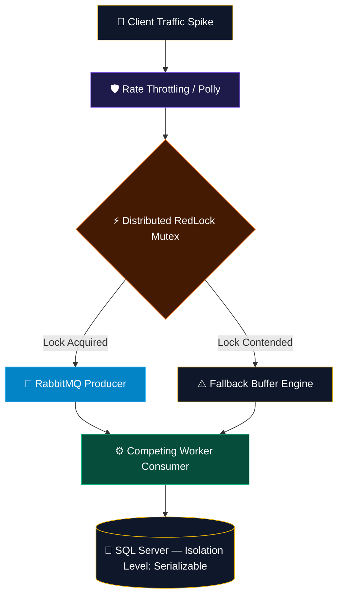
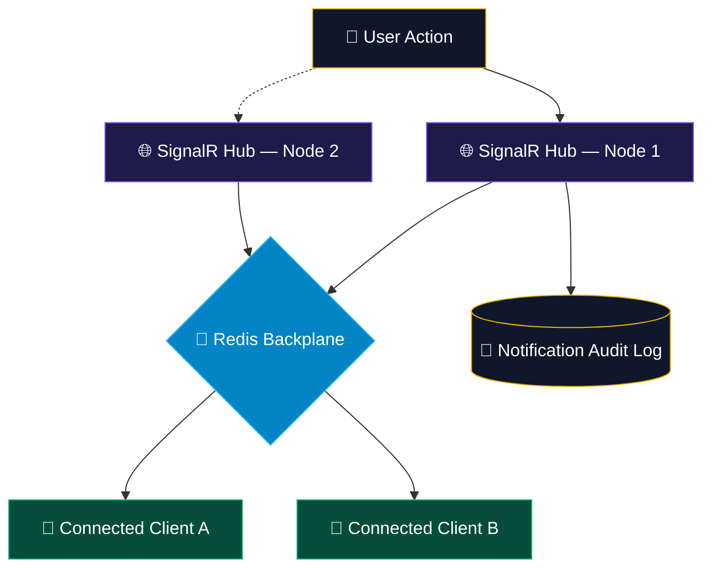

 

  

  
  
  

  

 

 

## 👑 01 &nbsp;·&nbsp; SYSTEM PERFORMANCE TELEMETRY

Benchmarked under sustained synthetic load — **10,000 VUs**, 30-min soak, 3-node Kubernetes cluster (2 vCPU / 4Gi per pod) — via **k6 → Prometheus → Grafana**. Figures reflect steady-state, not cold-start.

 

**Fleet health**

 

| Service | Status | P50 | P95 | P99 (SLA target) | Load profile |
|:--|:--:|--:|--:|--:|:--|
| 🚀 **HTTP API Pipeline** ASP.NET Core 9 · Kestrel | 🟢 Healthy | `1.4ms` | `4.6ms` | `7.2ms` *(< 5ms)* | 10k req/s sustained |
| ⚡ **Distributed State** Redis Cluster · RedLock Mutex | 🟢 Healthy | `0.4ms` | `0.9ms` | `1.1ms` *(sub-ms)* | 96.4% cache hit ratio |
| 🔄 **Async Streaming** RabbitMQ · Competing Consumers | 🟢 Healthy | `80ms` | `160ms` | `220ms` lag | 10k msg/s · 0% loss |
| 🛡️ **Resilience Engine** Polly v8 · Circuit Breaker | 🟡 Degraded | — | — | `99.94%` avail. *(target 99.999%)* | 7 circuit trips / 30d |

<b>📌 Root cause — why Resilience Engine is 🟡, not 🟢</b>

 

Availability dipped below the five-nines target due to timeout spikes from a **downstream payment provider**, not the service itself. Retry success rate held at 91%, and zero cascading failures were observed. Mitigation: bulkhead isolation added around that dependency to contain blast radius — rollout tracked for next sprint.

<b>📈 Raw throughput bars (k6)</b>

 

`HTTP API Pipeline` &nbsp;
`Distributed State` &nbsp;&nbsp;&nbsp;&nbsp;
`Async Streaming` &nbsp;&nbsp;&nbsp;&nbsp;&nbsp;&nbsp;
`Resilience Engine` &nbsp;&nbsp;&nbsp;&nbsp;

 

 

## 🛠️ 02 &nbsp;·&nbsp; TECH STACK & ARCHITECTURE MATRIX

 

**🏗️ Core Engineering Stack**

**💾 Persistence, Caching & Message Queues**

**🛡️ Security, Testing & Telemetry**

 

 

## 📊 03 &nbsp;·&nbsp; LIVE GitHub ANALYTICS

  

  

 

 

## ⚙️ 04 &nbsp;·&nbsp; FEATURED ARCHITECTURAL SYSTEMS

### 🎟️ DevPulse — High-Throughput Event Engine

Distributed monolithic architecture built to absorb high-concurrency traffic spikes with zero race conditions.

 

### 📡 NotifyHub — Real-Time Push Notification Service

SignalR-backed fan-out layer with a Redis backplane for horizontally scaled, multi-node WebSocket delivery.

 

 

## 📬 05 &nbsp;·&nbsp; GET IN TOUCH

Open to backend architecture roles, distributed-systems collaborations, and performance-engineering conversations.

  
  
  

 

