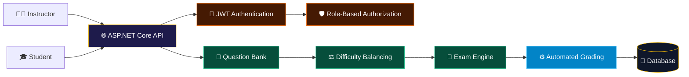
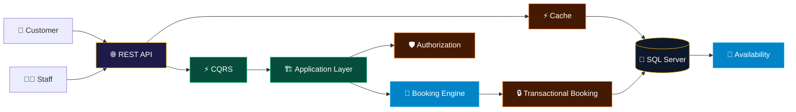
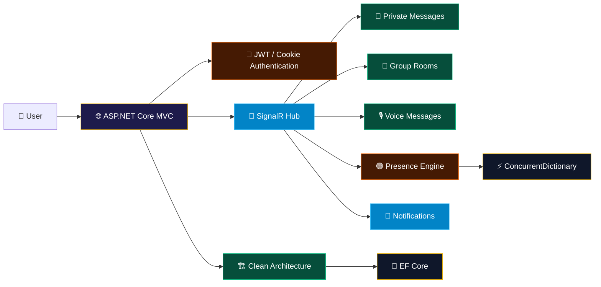

<!-- ╔══════════════════════════════════════════════════════════════╗ -->

<!-- ║                       SYSTEM BOOT                            ║ -->

<!-- ╚══════════════════════════════════════════════════════════════╝ -->

 

  

  

 

  

<!-- ═══════════════════════════════════════════════════════════════ -->

<!--                         01 / CORE                              -->

<!-- ═══════════════════════════════════════════════════════════════ -->

# 👑 01 / BACKEND CORE

<table width="100%" border="0">

<tr>

<td width="25%" align="center">

### API ENGINEERING

ASP.NET Core
Web API
MVC
RESTful APIs

</td>

<td width="25%" align="center">

### ARCHITECTURE

Clean Architecture
CQRS
MediatR
Repository Pattern
SOLID

</td>

<td width="25%" align="center">

### SECURITY

ASP.NET Identity
JWT
2FA
OTP
OAuth 2.0
Email Verification

</td>

<td width="25%" align="center">

### QUALITY

Unit Testing
Integration Testing
API Testing
Performance Testing
Mocking

</td>

</tr>

</table>

 

<table width="100%" border="1" bordercolor="#eab308">

<tr>

<td align="center">

<h2>⚡ ENGINEERING PRINCIPLES</h2>

  

Design simple systems. 
Keep business logic clear. 
Avoid unnecessary complexity. 
Build for maintainability.

</td>

</tr>

</table>

 

  

<!-- ═══════════════════════════════════════════════════════════════ -->

<!--                    02 / TECH STACK                             -->

<!-- ═══════════════════════════════════════════════════════════════ -->

# 🛠️ 02 / TECH STACK MATRIX

 

<table width="100%" border="0" cellspacing="15">

<!-- ROW 1 -->

<tr>

<td width="50%" valign="top">

<table width="100%" border="1" bordercolor="#eab308">

<tr>

<td align="center" style="padding:22px;">

<h2>⚡ LANGUAGE & RUNTIME</h2>

 

  

</td>

</tr>

</table>

</td>

<td width="50%" valign="top">

<table width="100%" border="1" bordercolor="#eab308">

<tr>

<td align="center" style="padding:22px;">

<h2>🌐 BACKEND</h2>

 

  

</td>

</tr>

</table>

</td>

</tr>

<!-- ROW 2 -->

<tr>

<td width="50%" valign="top">

<table width="100%" border="1" bordercolor="#eab308">

<tr>

<td align="center" style="padding:22px;">

<h2>🏗️ ARCHITECTURE</h2>

 

  

</td>

</tr>

</table>

</td>

<td width="50%" valign="top">

<table width="100%" border="1" bordercolor="#eab308">

<tr>

<td align="center" style="padding:22px;">

<h2>💾 DATA LAYER</h2>

 

  

</td>

</tr>

</table>

</td>

</tr>

<!-- ROW 3 -->

<tr>

<td width="50%" valign="top">

<table width="100%" border="1" bordercolor="#eab308">

<tr>

<td align="center" style="padding:22px;">

<h2>🔐 SECURITY</h2>

 

  

</td>

</tr>

</table>

</td>

<td width="50%" valign="top">

<table width="100%" border="1" bordercolor="#eab308">

<tr>

<td align="center" style="padding:22px;">

<h2>📡 REAL-TIME & JOBS</h2>

 

  

</td>

</tr>

</table>

</td>

</tr>

<!-- ROW 4 -->

<tr>

<td width="50%" valign="top">

<table width="100%" border="1" bordercolor="#eab308">

<tr>

<td align="center" style="padding:22px;">

<h2>🧪 TESTING</h2>

 

  

</td>

</tr>

</table>

</td>

<td width="50%" valign="top">

<table width="100%" border="1" bordercolor="#eab308">

<tr>

<td align="center" style="padding:22px;">

<h2>🔧 DEVELOPMENT</h2>

 

  

</td>

</tr>

</table>

</td>

</tr>

</table>

 

  

<!-- ═══════════════════════════════════════════════════════════════ -->

<!--                    03 / PROJECTS                               -->

<!-- ═══════════════════════════════════════════════════════════════ -->

# 🚀 03 / FEATURED SYSTEMS

 

<!-- EXAM -->

<table width="100%" border="1" bordercolor="#eab308">

<tr>

<td align="center" style="padding:28px;">

<h1>🎓 EXAMINATION SYSTEM</h1>

<b>Multi-Role Examination Platform</b>

A backend system built around instructors, students,
automated grading, reusable question banks, and secure access control.

 

 

</td>

</tr>

</table>

 

<!-- HOTEL -->

<table width="100%" border="1" bordercolor="#eab308">

<tr>

<td align="center" style="padding:28px;">

<h1>🏨 HOTEL RESERVATION SYSTEM</h1>

<b>Clean Architecture + CQRS</b>

Reservation backend focused on transactional booking,
room availability, authorization, caching, and optimized data access.

 

 

</td>

</tr>

</table>

 

<!-- CHAT -->

<table width="100%" border="1" bordercolor="#eab308">

<tr>

<td align="center" style="padding:28px;">

<h1>📡 REAL-TIME CHAT SYSTEM</h1>

<b>ASP.NET Core MVC + SignalR + Clean Architecture</b>

Real-time communication system supporting private messaging,
group rooms, voice messages, notifications, and live user presence.

 

 

</td>

</tr>

</table>

 

  

<!-- ═══════════════════════════════════════════════════════════════ -->

<!--                    04 / TESTING                                -->

<!-- ═══════════════════════════════════════════════════════════════ -->

# 🧪 04 / TESTING LAB

 

<table width="100%" border="1" bordercolor="#eab308">

<tr>

<td align="center" width="25%" style="padding:22px;">

<h3>UNIT</h3>

NUnit
Moq
Assertions
Parameterized Tests

</td>

<td align="center" width="25%" style="padding:22px;">

<h3>INTEGRATION</h3>

WebApplicationFactory
EF Core In-Memory
Dependency Injection
Test Server

</td>

<td align="center" width="25%" style="padding:22px;">

<h3>API</h3>

HttpClient
HTTP Testing
Swagger
Postman

</td>

<td align="center" width="25%" style="padding:22px;">

<h3>PERFORMANCE</h3>

Latency
Throughput
Load Testing
Stress Testing

</td>

</tr>

</table>

 

 

  

<!-- ═══════════════════════════════════════════════════════════════ -->

<!--                    05 / ANALYTICS                              -->

<!-- ═══════════════════════════════════════════════════════════════ -->

# 📊 05 / GITHUB TELEMETRY

 

  

  

 

  

<!-- ═══════════════════════════════════════════════════════════════ -->

<!--                    06 / MINDSET                                -->

<!-- ═══════════════════════════════════════════════════════════════ -->

# 🧠 06 / ENGINEERING MINDSET

 

<table width="100%" border="1" bordercolor="#eab308">

<tr>

<td align="center" style="padding:35px;">

<h1>BUILD → TEST → MEASURE → IMPROVE</h1>

 

I focus on building backend systems with clear business logic,
secure APIs, maintainable architecture, reliable data access,
real-time communication, and automated testing.

 

</td>

</tr>

</table>

 

  

<!-- ═══════════════════════════════════════════════════════════════ -->

<!--                    07 / CONTACT                                -->

<!-- ═══════════════════════════════════════════════════════════════ -->

# 📬 07 / CONNECT

 

<h2>⚡ NOUR TOHAMY</h2>

<b>Backend .NET Developer</b>

Cairo, Egypt

 

  

 

© NOUR TOHAMY · BACKEND ENGINEERING · .NET · C#

 

